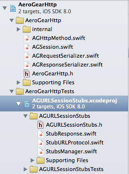

# aerogear-ios-httpstub

A small library inspired by [OHHTTPStubs](https://github.com/AliSoftware/OHHTTPStubs) to stub your network requests written in Swift.

> This module is beta software, it currently supports Xcode 6 Beta 6.

## Example Usage

```swift
// set up http stub
StubsManager.stubRequestsPassingTest({ (request: NSURLRequest!) -> Bool in
    return true
}, withStubResponse:( { (request: NSURLRequest!) -> StubResponse in
    return StubResponse(data:NSData.data(), statusCode: 200, headers: ["Content-Type" : "text/json"])
}))

// async test expectation
let registrationExpectation = expectationWithDescription("testStubWithNSURLSessionDefaultConfiguration");

let request = NSMutableURLRequest(URL: NSURL(string: "http://server.com"))

let config = NSURLSessionConfiguration.defaultSessionConfiguration()
let session = NSURLSession(configuration: config)

let task = session.dataTaskWithRequest(request) {(data, response, error) in
    XCTAssertNil(error, "unexpected error")
    XCTAssertNotNil(data, "response should contain data")
    
    registrationExpectation.fulfill()
}

task.resume()

waitForExpectationsWithTimeout(10, handler: nil)
```
## Adding this library to your project
To use AGURLSessionStubs to test your iOS applications, follow these 3 easy steps:

1. Clone the aerogear-ios-httpstub repository
2. Add `AGURLSessionStubs.xcodeproj` to your test target
3. Start using it!

### 1. Clone the aerogear-ios-httpstub repository

```
git clone git@github.com:aerogear/aerogear-ios-httpstub.git
```
You can alternatively add the project as github submodule to ease configuration for other users. 

### 2. Add `AGURLSessionStubs.xcodeproj` to your test target

Right-click on the group containing your application's tests and
select `Add Files To YourApp...`.

Choose `AGURLSessionStubs.xcodeproj`

Once you've added the Quick project, you should see it in Xcode's project
navigator, grouped with your tests.



See project [aerogear-ios-http](https://github.com/corinnekrych/aerogear-ios-http.git) as an example using it.

### 3. Start using it!

If you run into any problems, please [file an issue](http://issues.jboss.org/browse/AEROGEAR) and join our [mailing list](https://lists.jboss.org/mailman/listinfo/aerogear-dev)


